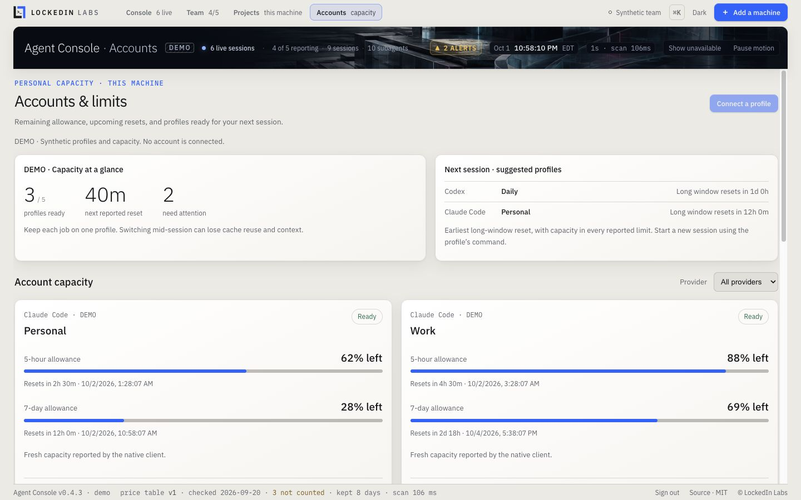
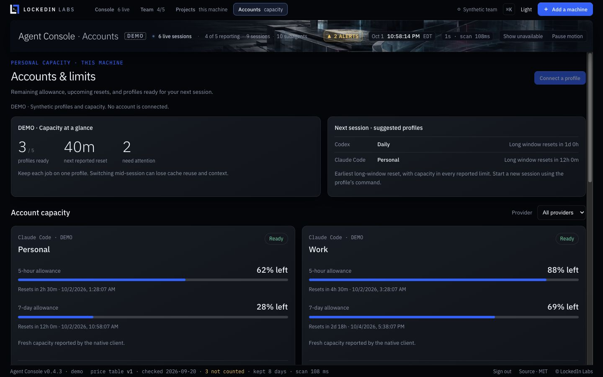
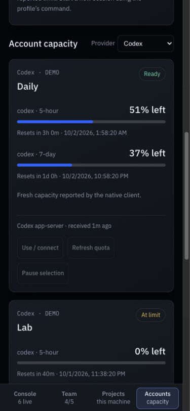

# Account capacity

**Accounts** is a local view for people who use separate native Claude Code
or Codex profiles. It shows remaining allowance, reset times, source freshness,
and which profile can take a new session. Open the Accounts tab or press **4**.
Try it with `agent-console --demo`; every demo profile is synthetic.



<details><summary>Dark mode and phone view</summary>




</details>

This is separate from token accounting. A 70% weekly allowance is not a token
count, an API credit balance, or 70% of a bill. Percentages from different
accounts and plans are never added together. The dashboard's token totals
still come from supported local transcripts and enrolled reporters.

## Connect a profile

1. Sign in through the **unmodified native client**. For Codex, the client home
   is normally `~/.codex`; for Claude Code, `~/.claude`. Use a separate native
   home for each account. `CODEX_HOME` and `CLAUDE_CONFIG_DIR` select these homes.
2. Choose **Connect a profile** in Accounts. Enter an alias, a short ID, the
   client, and the full path to its existing home directory. A profile is a
   directory you selected, not independently verified account identity. Do not
   register the same account under several homes and treat it as extra capacity.
3. For **Codex**, choose **Refresh quota**. The installed native CLI reads its
   documented `account/rateLimits/read` interface. It makes no model request.
4. For **Claude Code**, choose **Use / connect** and add the shown status-line
   command to that profile's Claude settings. Requires Claude Code **v2.1.251+**
   with quota fields available. The native client supplies these fields after
   a response; missing fields remain unknown. Preserve an existing status line
   by calling the capture command from its script with the same JSON input.

Agent Console never reads or imports OAuth files, passwords, API keys, or
browser cookies. Claude login completes through Anthropic's own flow. The
Codex CLI manages its existing sign-in. No private provider endpoint is called
by Agent Console, and no third-party proxy is installed.

The status-line adapter allowlists the two quota windows and an optional
provider-reported spend limit. It discards session IDs, prompts, directories,
model context, credentials, and all other input fields before storage. Quota
metadata stays in the local hub's `accounts` directory, not in team reporting.

## Start work on a suitable account

After installation, these commands use the same local state as the console:

```sh
agent-console accounts list
agent-console accounts recommend --provider codex
agent-console accounts run --provider codex
agent-console accounts run --provider claude-code
```

`run` selects a **new native session**, not an HTTP proxy endpoint. For Codex it
refreshes registered, enabled profiles first. It chooses the available profile
whose longest reported allowance resets first, passes that profile's native
home to the client, and leaves it there for the whole session. It does not retry
on another account, change models, buy credits, or transfer session history.
Native arguments follow `--`. Work launched through the native client uses
that account's allowance and any billing options enabled in the client.

For an explicit profile, including native sign-in:

```sh
agent-console accounts launch --id personal -- login
```

Use the native client's supported login arguments. For a source checkout,
replace `agent-console` with `node bin/agent-console.mjs`. Every command accepts
`--state-dir` if the console uses a custom hub state directory. **Use / connect**
prints commands for the running installation and that exact state directory.

API-key and custom endpoint environment overrides are refused by these
subscription-profile commands, because they can bypass the selected account.
Provider configuration can also affect routing; inspect your native profile
configuration when connecting it. API usage remains visible through the
console's normal collectors, independently of this feature.

## What qualifies as ready

- All reported windows must contain valid percentages and reset timestamps.
- Every reported allowance must have capacity left.
- The reading must be no more than ten minutes old.
- No reported reset may have passed without a new reading.
- The profile must be enabled, with no failed refresh.

A zero remaining percentage is exhausted. Missing data is unknown. A passed
reset is **Confirm reset**, not an invented full allowance. Received time is
when the local client supplied the reading, not a guarantee that the provider
has real-time data. Model-specific limits absent from the source cannot be
inferred; the native client remains authoritative when starting work.

**Pause selection** excludes a profile without signing it out or deleting its
native files. The local console supports up to 32 profiles. Refresh requests
are coalesced per profile, separated by at least 30 seconds, and limited to two
concurrent native reads, each with a 15-second timeout and bounded output.

## Boundaries and provider references

- [Codex app-server](https://developers.openai.com/codex/app-server): native
  account rate-limit windows and named buckets.
- [Claude Code status line](https://code.claude.com/docs/en/statusline): supported
  local quota fields, availability, and version requirements.
- [Claude authentication and credential use](https://code.claude.com/docs/en/legal-and-compliance):
  native sign-in and restrictions on subscription credential intermediation.

This feature takes inspiration from quota dashboards such as
[CLIProxyAPI](https://github.com/router-for-me/CLIProxyAPI) and
[VibeProxy](https://github.com/automazeio/vibeproxy), but includes no code or
credential-routing implementation from either project. It does not support
account detection evasion, residential-IP disguises, or subscription OAuth
pooling. There is no promise of avoided API charges or transferable credits.

Enterprise capacity is a separate integration: directory identities, approved
provider connections, shared limits, budgets and enforcement stay in the
enterprise control plane. Local profile labels do not establish enterprise
identity or grant permission to use an account.
